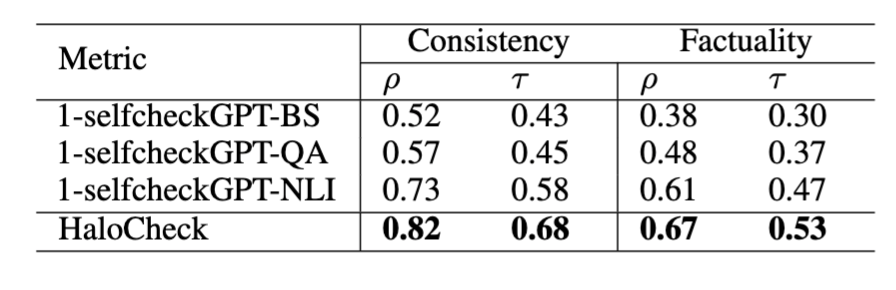

# HaLo: Estimation and Reduction of Hallucinations in Open-Source Weak Large Language Models

This repository contains the source code for **HaloCheck**, a component discussed in our research paper titled "**HaLo: Estimation and Reduction of Hallucinations in Open-Source Weak Large Language Models**."

## Code/Package

### Installation
To install HaloCheck, use the following pip command:

```shell
pip install git+https://github.com/EngSalem/HaLo.git
```

### HaloCheck: A BlackBox Knowledge-Free Hallucination Severity Estimator for LLM Responses
HaloCheck is a tool designed to estimate the severity of hallucinations in Large Language Model (LLM) responses. It operates on the principles of cross entailment and is built upon similar concepts as [selfcheckGPT](https://github.com/potsawee/selfcheckgpt), albeit with some key distinctions.

HaloCheck primarily focuses on assessing hallucination severity at a sentence-level granularity. It evaluates whether an LLM generates consistent information across its various response samples, thereby providing a finer-grained estimation of the severity of hallucinations.

## HaloCheck better correlates both (*pearson $\rho$ and kendal tau $\tau$) with human annotation of consistency and avergae factuality of the answers compared to selfcheckGPT. 


*Note that we developed HaLoCheck around the same time selfcheckGPT added NLI (entailment wasn't part of the original selfcheckGPT).
*We take into account all samples and use SummaC which facilitates computing of entailment between two pieces of text.
*HaloCheck range is easily interpreted [-1,1] where -1 indicated infactual, 1 factual. The higher the score the more consistent your samples are. 

## HaloCheck is also faster than all selfcheckGPT measures, and doesn't need LLM calls. Although it's knowledge free, therefore its incapable of identifying consistent inaccuracies.


## How to Use HaloCheck

To use HaloCheck in your Python code, follow these steps:

```python
import HaloCheck as checker

inconsistent_samples = [
    'The 1958 NBA Finals was played between the St. Louis Hawks and Boston Celtics. The Hawks won the series 4 games to 2 in the best of 7 playoff.',
    'The 1958 NBA Finals was played between the Minneapolis Lakers and Boston Celtics and was won by the Lakers 4 games to 3.',
    'The 1958 NBA Finals was played on April 17, 1958, between the Boston Celtics and the St. Louis Hawks.',
    'The 1958 NBA Finals was played between the Boston Celtics and Minneapolis Lakers. The Celtics won the series 4 games to 2 for their 5th championship.',
    'The 1958 NBA Finals was played between the Boston Celtics and Minneapolis Lakers. The MVP of the 1958 NBA Finals was Bill Russell.'
]

scorer = checker.HaloCheck(device='cpu', granularity='sentence', model='mnli')  # Change to 'cuda' if a GPU is available
print(scorer.score(inconsistent_samples))
# Expected score: -0.417 (indicating inconsistency)
```

Feel free to modify and adapt the code to suit your specific use case and requirements.

---

*Note: This repository is part of ongoing research, and the tools provided here are subject to further updates and improvements.*
